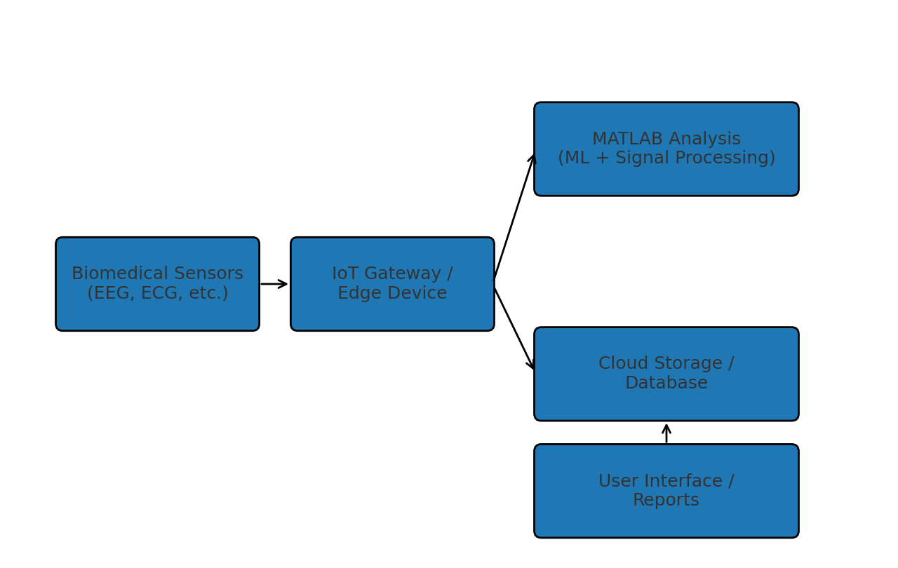
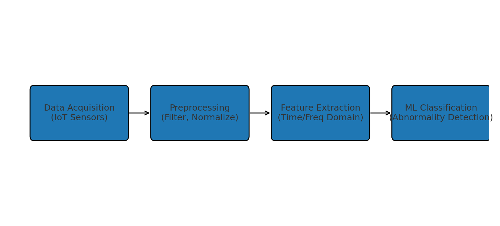

# Biomedical Abnormality Analysis IoT


> MATLAB‑driven biomedical signal analytics over IoT pipelines: load data via IoT, analyze for abnormalities, visualize and report.

---

## Project Summary

- **Core:** Data ingestion via IoT-fed biomedical devices, analyzed in **MATLAB** using machine learning routines.
- **Artifacts:**
  - `Week6Project_MLCode.m`: MATLAB script for ML-based abnormality detection.
  - `Bio_Abnormality_Analysis_Paper.pdf`: Comprehensive project documentation and findings.
- **Scope:** Capstone-level prototype applying ML to bio-signal monitoring over IoT infrastructure.

---

## Repository Contents

```
├─ Week6Project_MLCode.m              # MATLAB script for abnormality detection via IoT signals
├─ Bio_Abnormality_Analysis_Paper.pdf # Project documentation, methodology & evaluation
└─ LICENSE                            # MIT
```

---

## Setup Instructions

### 1) Prepare Your Environment

Ensure you have **MATLAB (R2022a or later recommended)** installed with Machine Learning and Signal Processing Toolboxes.

### 2) Load the Project

```bash
git clone https://github.com/meldiet27/Biomedical-abnormality-analysis-through-Internet-of-Things-IoT-.git
cd Biomedical-abnormality-analysis-through-Internet-of-Things-IoT-
```

### 3) Review Documentation

Open `Bio_Abnormality_Analysis_Paper.pdf` to understand the project structure, dataset, ML models, and evaluation metrics.

### 4) Run Analysis Script

In MATLAB:

```matlab
open('Week6Project_MLCode.m');
run;
```

Inspect variable outputs, plots, and diagnostic messages for detected abnormalities.

---

## IoT Data Flow



---

## ML Pipeline



---

## Configuration Notes

- Data ingestion assumes IoT-compatible biomedical sensors streaming into MATLAB-compatible formats (e.g., CSV, MQTT feed).
- If integrating live IoT streams, adapt data-loading sections in `Week6Project_MLCode.m` to your data source.

---

## Troubleshooting

- **Script errors:** Ensure required MATLAB toolboxes are present; update function calls if using older versions.
- **No output or plots:** Validate data loading logic; insert breakpoints or debug prints to confirm real data ingestion.

---

## Roadmap

- Real-time IoT ingestion via MQTT or REST APIs.
- Enhanced ML models (e.g., deep learning for anomaly classification).
- GUI front-end (MATLAB App Designer) for real-time visualization.
- Multi-sensor fusion inputs and threshold-based alerting.

---

## Contributing

1. Fork → branch → commit with clarity (purpose, inputs, outputs).
2. Upload updated `.m` scripts or dataset simulators.
3. Open PR with description of enhancements and test evidence.

---

## License

This project is licensed under the **MIT License** — see [`LICENSE`](LICENSE).

---

## Acknowledgments

This work builds on foundational research from:

**Sirven JI.** Epilepsy: A Spectrum Disorder. Cold Spring Harb Perspect Med. 2015 Sep 1;5(9):a022848. doi:10.1101/cshperspect.a022848. PMID:26328931; PMCID:PMC4561391.

**Light GA, Williams LE, Minow F, Sprock J, Rissling A, Sharp R, Swerdlow NR, Braff DL.** Electroencephalography (EEG) and event-related potentials (ERPs) with human participants. Curr Protoc Neurosci. 2010 Jul;Chapter 6:Unit 6.25.1-24. doi:10.1002/0471142301.ns0625s52. PMID:20578033; PMCID:PMC2909037.

**Britton JW, Frey LC, Hopp JL, et al.; St. Louis EK, Frey LC, editors.** Electroencephalography (EEG): An Introductory Text and Atlas of Normal and Abnormal Findings in Adults, Children, and Infants [Internet]. Chicago: American Epilepsy Society; 2016. The Normal EEG. Available from: https://www.ncbi.nlm.nih.gov/books/NBK390343

**Fisher RS, Scharfman HE, deCurtis M.** How can we identify ictal and interictal abnormal activity? Adv Exp Med Biol. 2014;813:3-23. doi:10.1007/978-94-017-8914-1_1. PMID:25012363; PMCID:PMC4375749.

---
### Author

**Melanie Dietrich**  
Department of Electrical and Computer Engineering  
Stevens Institute of Technology · mdietri1@stevens.edu
